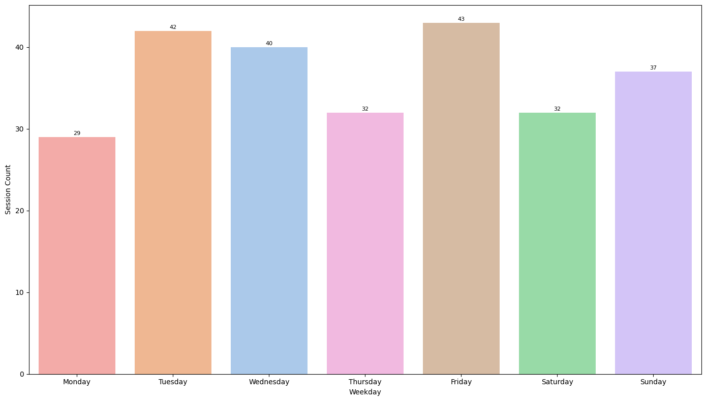
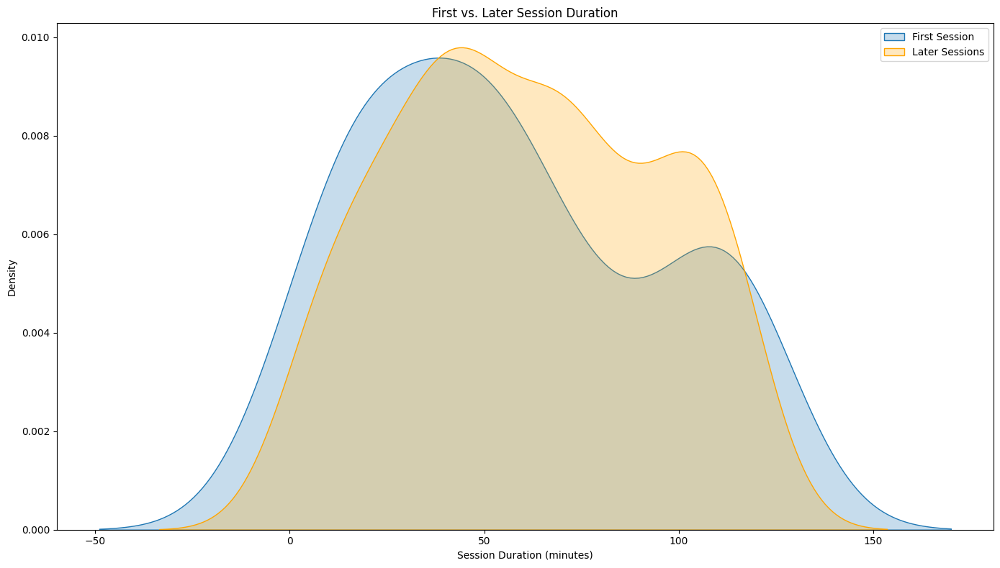
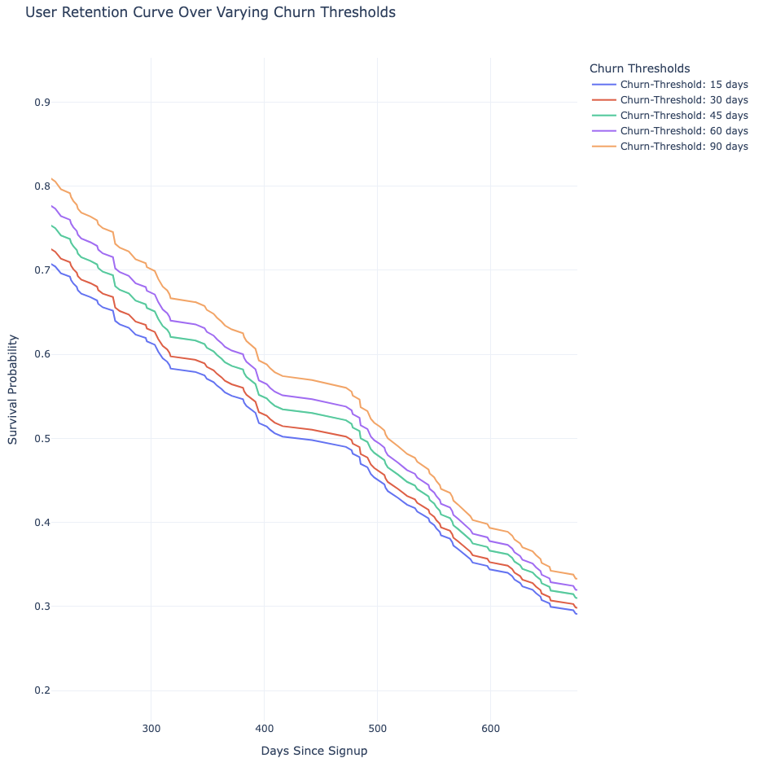

# 📊 User Session Behavior Analysis & EDA (2123–2127)

**A complete pipeline to simulate user activity, transform and analyze behavioral trends, and generate a rich, interactive HTML report.**

> 💡 *From synthetic data to strategic insights — understand when users engage, what features they use, and how to retain them better.*

---

## 🚀 Overview

This project builds a data-driven foundation for analyzing **user engagement patterns over time** using:
- Synthetic data generation with Python
- Data transformation with SQL
- Interactive visualization with Python (Seaborn, Matplotlib, Plotly, Kaplan-Meier)

The final report is output as a **clickable, zoomable, fully annotated** [EDAReport](https://htmlpreview.github.io/?https://raw.githubusercontent.com/sherozshaikh/synthetic_user_journey_eda/main/docs/EDA_Report.html) file that helps teams make better product decisions.

---

## 📁 Project Structure

```

📦 project
│
├── generate_synthetic_user_data.py                # ⛏️ Creates fake user/session data
├── transform_user_sessions.sql                    # 🔌 SQL script to query and extract relevant user session data from the server
├── analyze_user_behavior_and_generate_report.py   # 📊 EDA + HTML report generation
├── synthetic_user_sessions.csv                    # 🧾 Generated data
└── EDA_Report.html                                # 🖥️ Final interactive report

```

---

## 🔍 Key Features

- ✅ 50 unique users over a 5-year simulated span (2123–2127)
- ✅ Device-level comparisons: signup vs. session usage
- ✅ Time-based analysis: hourly trends, weekly patterns, session evolution
- ✅ Feature usage breakdowns per cohort
- ✅ Kaplan-Meier retention curves
- ✅ Annotated plots with interpretation guides
- ✅ One-click interactive HTML report

---

## 📊 Exploratory Data Analysis Highlights

### 📌 Figure 1: Unique user counts per cohort
Bar chart showing which cohorts are most populated and sorted in descending order.

### 📌 Figure 2: Signup vs Session Device Comparison
Stacked bar comparing device types used during signup vs. session activity.

### 📌 Figure 3: Session Volume by Hour of Day
Line plot with KDE overlay to identify peak engagement hours.

---

### 📷 Figure 4: **Session Volume by Day of the Week**
> *What day do users prefer? Understand peak weekday traffic to time campaigns better.*

**Session Volume Weekday**

<p align="middle">
  
</p>

---

### 📌 Figure 5: Logins by Weekday
Heatmap-style or bar chart of total logins broken down by day of the week.

### 📌 Figure 6: Feature Usage by Cohort
Visual comparison of how features are used across user groups (cohorts).

---

### 📌 Figure 7: High-Engagement Feature Frequencies
Average per-user usage frequency for features with high engagement.

### 📌 Figure 8: Total Feature Usage
Simple bar chart ranking all features by usage volume.

### 📌 Figure 9: Session Frequency Distribution
Histogram with log-scaled y-axis to normalize heavy-tailed usage behavior.

---

### 📷 Figure 10: **Session Duration: First vs Later Sessions**
> *Do users get more engaged or drop off over time? This chart tells the story.*

**Session Duration Comparison**

<p align="middle">
  
</p>

---

### 📌 Figure 11: Session Duration Over Time by Cohort
Trend line showing how average session duration changes across cohorts over time.

---

### 📷 Figure 12: **User Retention Curves**
> *Model user survival using Kaplan-Meier curves across multiple churn thresholds.*

**Retention Kaplan Meier Curves**

<p align="middle">
  
</p>

---

## 📂 How to Run

1. 🔧 Create and activate a virtual environment:

```bash
pip3 install uv

# Install Python 3.12 with uv (optional but good practice if version isolation is needed)
uv python install 3.12

# Create a virtual environment with uv
uv venv

# Activate the virtual environment
source .venv/bin/activate  # or .venv\Scripts\activate on Windows
```

2. 📦 Install dependencies:

```bash
uv pip install pandas numpy seaborn matplotlib plotly lifelines faker git
uv pip freeze > requirements.uv

# For repeatable installs in CI or team environments:
uv pip install -r requirements.uv
```

3. 📁 Clone the repository:

```bash
git clone https://github.com/sherozshaikh/synthetic_user_journey_eda.git
cd synthetic_user_journey_eda
```  

4. 🏗️ Generate the dataset and run the report pipeline:

```bash
uv run generate_synthetic_user_data.py
uv run analyze_user_behavior_and_generate_report.py
```

5. Open [EDA_Report.html](https://htmlpreview.github.io/?https://raw.githubusercontent.com/sherozshaikh/synthetic_user_journey_eda/main/docs/EDA_Report.html) in your browser for full visual report!

---

## 🧠 How to Interpret the Report

Each plot in the HTML report comes with:

* ✅ **Title** — A clear description of what the graph shows
* ✅ **Short Insight** — What to look for or what the trend reveals
* ✅ **Interpretation Help** — Guidance on how the plot can support product or UX decisions

For example:

> **📈 Figure 12 (Retention Kaplan Meier Curves)** shows how many users remain active over time.
> A sharper drop indicates higher churn — a key metric for assessing feature stickiness or onboarding success.

---

## 🧰 Tech Stack

* **Python** (Pandas, Numpy, Seaborn, Plotly, Matplotlib, Lifelines)
* **SQL** (PostgreSQL-style queries via PostHog)
* **Faker** (Synthetic data)

---

## 🎯 Use Cases

* 📊 Product Usage Dashboards
* 🎯 Growth & Retention Analysis
* 🧪 Experiment Design / Simulation
* 🗂️ Data Science Prototyping
* 🎓 Training, Demos, or Workshops

---

> 💬 *“Data is only useful if it tells a story. This EDA report helps your team listen to the users through every session.”*
